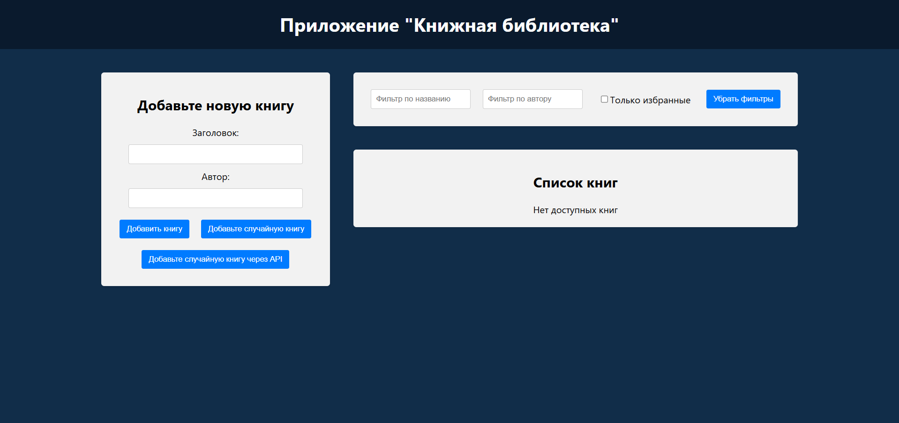
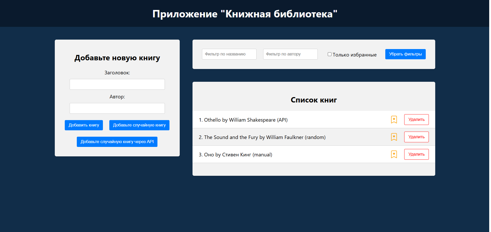
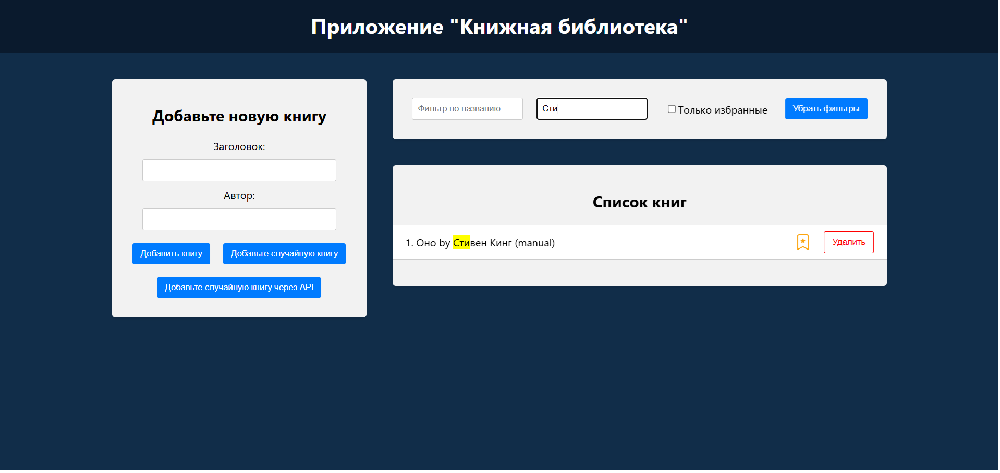

# Структура проекта

**Основные каталоги:**

```
.
└── api /
    ├── data/
    ├── index.js
    ├── package-lock.json
    ├── package.json
    ├── frontend/
    │   ├── public/
    │   ├── src/
    │   │   ├── assest/
    │   │   ├── components/
    │   │   ├── data/
    │   │   ├── redux/
    │   │   ├── utils/
    │   │   ├── App.css
    │   │   ├── App.jsx
    │   │   ├── index.css
    │   │   └── main.jsx
    │   ├── eslint.condig.js
    │   ├── package-lock.json
    │   └── package.json
    ├── screenshots/
    ├── index.html
    ├── README.md
    ├── vite.config.js
    ├── .gitignore
    ├── package-lock.json
    └── package.json

```

=======

# Book library app (Vite + React + Redux)





## О проекте

Book Library App — приложение для отображения и фильтрации списка книг.
Пользователь может фильтровать книги по автору и названию, отмечать любимые книги и удалять книги из списка. В проекте используется имитация сервера с базой книг. Пользователь может подгружать книги с сервера (json-файл).

## Технологии

- Vite
- React (функциональные компоненты, react-dom, react-icons, react-toastify)
- Redux (Redux Toolkit)
- CSS
- uuid
- axios
- eslint (eslint-plugin-react-hooks, eslint-plugin-react-refresh)

## Установка и запуск

```bash
git clone https://github.com/NikRNN/Book-Library-App.git
cd Book-Library-App
npm install
npm run dev (для фронтенда)
node index.js (для сервера)
```
